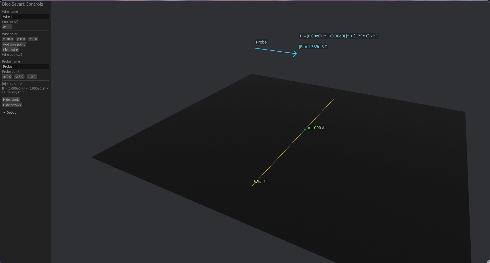

# Biot Savart Simulator

## Introduction
This project is a Biot Savart Simulator that allows users to visualize the magnetic field generated by a current-carrying wire. The simulator provides an interactive interface where users can adjust the parameters of the wire and observe the resulting magnetic field in real-time.

## Purpose
This project was done for MTH 300 - Vector Analysis. The goal was to create a program that uses the material from this class and applies it to a real-world scenario: programming.

## Features
- Interactive interface for adjusting wire parameters (current, length, position).
- Real-time visualization of the magnetic field generated by the wire.
- 3D Viewer for better undestaanding of magnetic field vectors

## How to Use
### READ THIS!!!!
0. **Install [Dependencies](https://github.com/bevyengine/bevy/blob/latest/docs/linux_dependencies.md) for Bevy!!!!!!**
### Releases
1. Donwload the latest release from the [Releases](https://github.com/TegranGrigorian/Biot-Savart/releases) page.
    1. Only compiling for linux and X86, if you use a different OS or architecture, you will need to compile the source code.
1. Allow the executable to run
    ```shell
    chmod +x ./Biot-Savart
    ```
1. Run the executable
    ```shell
    ./Biot-Savart
    ```

### Source Code
1. Clone the repository to your local machine.
1. Compile program with Cargo
    ```shell
    cargo build
    ```
1. Allow the executable to run
    ```shell
    chmod +x ./target/debug/Biot-Savart
    ```
1. Run the executable
    ```shell
    ./target/debug/Biot-Savart
    ```

## CLI
There is a CLI but its for development purposes only. It has the following commands:
* `--help` - Displays commands
* `--test` - Test the engine is calculating properly

## How to Use
### Setup the Simulator
1. Open Simualtor with ./Biot-Savart
1. Set a current by clicking the current box adn entering in a value
1. Add your first point in your wire, default is (0, 0, 0)
1. Add your second point in your wire by adjusting the respective x, y, and z values.
1. Add a probe to the magnetic field with its own x, y, and z values.
1. The viewer should now look like the image in begining of the readme.

### Navigate the Viewer
**Zoom** - Scroll up to zoom in and scroll down to zoom out.

**Rotate** - Hold left click and drag to rotate the viewer.

**Pan**
* **Touchpad**: Hold right click and left click to pan the viewer.
* **Mouse**: Hold middle click to pan the viewer.

## Conclusion
This isnt a really powerful or enterprise simulator. But it demonstrates my knowledge of vector calculus and applies it to a program. Thank you professor Clark for teaching this material and giving me the opportunity to create this project. I hope you enjoy it, if it works on your computer!